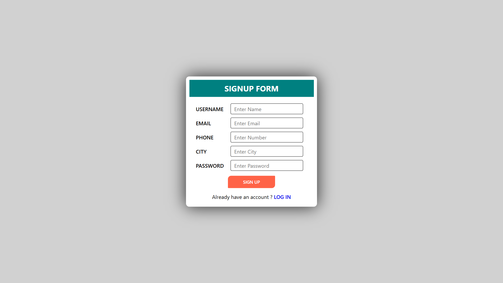
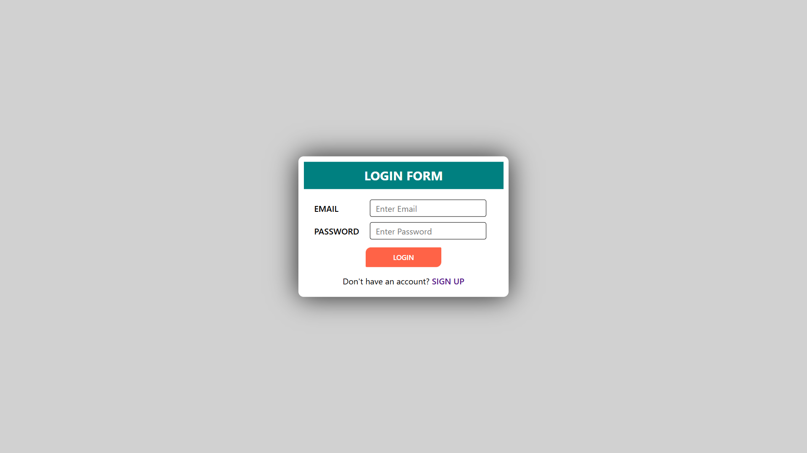

# 🔐 PHP User Authentication System

A simple user authentication project built with **PHP**, **MySQL**, **HTML**, **CSS**, and **JavaScript** that includes:

- 📝 User Registration
- 🔐 User Login
- 👋 Welcome Page with personalized greeting
- ✅ Form Validation (client + server-side)

🌐 **Live Demo:** [http://phpdb.wuaze.com](http://phpdb.wuaze.com)

---

## 🎯 Features

- 📬 **Email Uniqueness Validation** – Prevents duplicate registrations
- 📱 **Mobile Number Check** – Ensures exactly 10 digits
- ⚠️ **Client-Side Form Validation** – Alerts for missing fields
- 🛡️ **Server-Side Validation** – Secure backend checks
- 🔑 **Invalid Login Alert** – Shows alert for wrong credentials
- 👋 **Welcome Page** – Displays logged-in user's name
- 💾 **Data stored in MySQL database**

---

## 🧰 Technologies Used

| Layer        | Technologies         |
|--------------|----------------------|
| **Frontend** | HTML, CSS, JavaScript |
| **Backend**  | PHP                   |
| **Database** | MySQL                 |
| **Hosting**  | InfinityFree          |  

## 📸 Screenshots

### 📝 Registration Page  

### 🔐 Login Page  

### 👋 Welcome Page  

---

 

 
